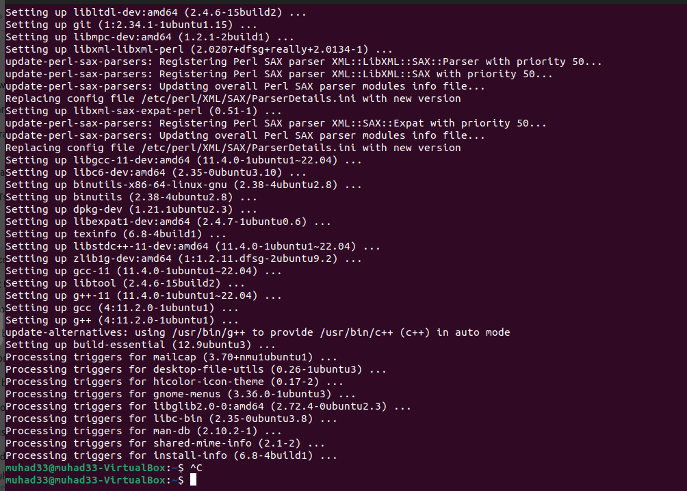
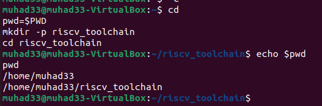
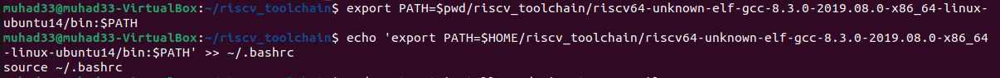
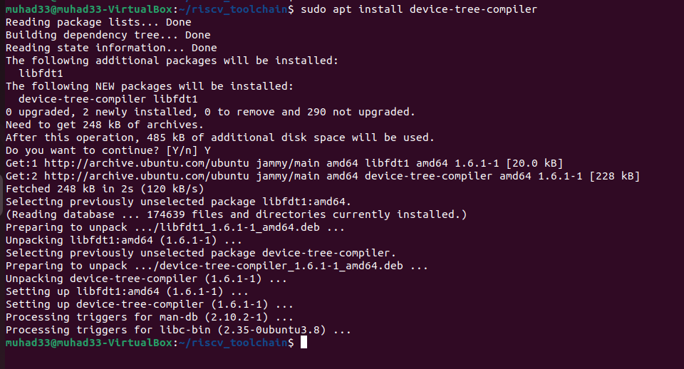
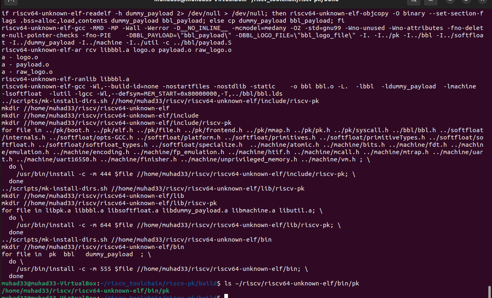
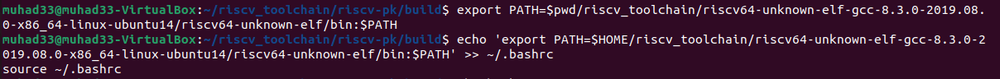
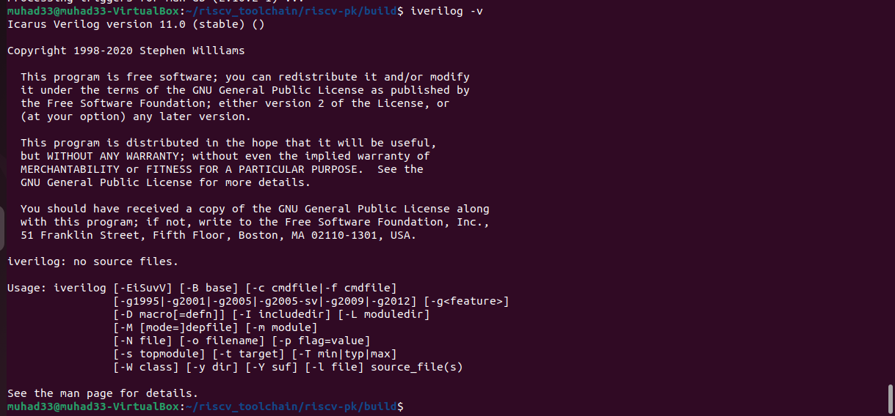
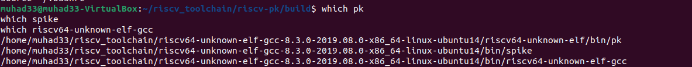

# 🛠️ Task 1: RISC-V Toolchain Setup & Uniqueness Test


---

## 🎯 Objective

Successfully install essential base developer tools required for compiling the RISC-V simulator, proxy kernel, and associated components.  
This includes compilers, linkers, autotools, and waveform visualizer **GTKWave**.

---

## 📋 Prerequisites

- ✅ Oracle VirtualBox installed on Windows  
- ✅ Ubuntu 22.04 LTS (64-bit) set up in a Virtual Machine  
- ✅ Minimum 2 vCPUs, 4GB RAM, 30GB disk space  
- ✅ Internet connectivity inside VM  
- ✅ `sudo` access in Ubuntu  

---

## 🚀 Task 1.1 - Install base developer tools

Why: These are common build prerequisites (compilers, linkers, autotools) and libraries
required by the RISC‑V simulator, proxy kernel, and other tooling. GTKWaves is included for
waveform viewing in digital design flows.

#### 📦 Step 1: Update APT Package Index

```bash
sudo apt update
```
#### 📦 Step 2: Install Developer Tools (Installation Command)

```bash
sudo apt-get install -y git vim autoconf automake autotools-dev curl \
libmpc-dev libmpfr-dev libgmp-dev gawk build-essential bison flex \
texinfo gperf libtool patchutils bc zlib1g-dev libexpat1-dev gtkwave
```
#### ✅ Installation Summary

- 📦 76 new packages were installed
- 🔄 6 packages were upgraded
- ❌ 0 packages were removed
- 📌 Examples of installed packages:
  - Development tools: `gcc`, `g++`, `make`, `binutils`, `build-essential`
  - Build tools: `autoconf`, `automake`, `libtool`, `bison`, `flex`
  - Libraries: `libgmp-dev`, `libmpfr-dev`, `libmpc-dev`, `zlib1g-dev`
  - Others: `curl`, `vim`, `git`, `gtkwave`, `texinfo`, `patchutils`
- 📡 Internet connection and working repositories were required
- ✅ Installation completed successfully with no errors

#### 🔴 Output


---

## 🧩 Task 1.2: Create Workspace and Capture Home Path

### 🎯 Objective

Create a dedicated `riscv_toolchain` directory in the home folder to organize all future RISC-V downloads and builds. Also store the `$HOME` path into a shell variable `$pwd` for reuse.

---

### ⚙️ Commands Used

```bash
cd
pwd=$PWD
mkdir -p riscv_toolchain
cd riscv_toolchain
```

### 🔴 Output


## 🚀 Task 1.3: Install RISC-V GCC Toolchain (Prebuilt)

### 🎯 Objective

Download and install the **SiFive prebuilt RISC-V GCC Toolchain**, which includes the compiler (`riscv64-unknown-elf-gcc`), assembler, linker, and other binaries necessary to build RISC-V binaries from C/C++ source code.

---

#### 📦 Step 1: Download the Prebuilt GCC Toolchain

```bash
cd $pwd/riscv_toolchain
wget https://static.dev.sifive.com/dev-tools/riscv64-unknown-elf-gcc-8.3.0-2019.08.0-x86_64-linux-ubuntu14.tar.gz
tar -xvzf riscv64-unknown-elf-gcc-8.3.0-2019.08.0-x86_64-linux-ubuntu14.tar.gz
```
#### 📦  Step 2: Add Toolchain to PATH
```bash
export PATH=$pwd/riscv_toolchain/riscv64-unknown-elf-gcc-8.3.0-2019.08.0-x86_64-linux-ubuntu14/bin:$PATH
echo 'export PATH=$HOME/riscv_toolchain/riscv64-unknown-elf-gcc-8.3.0-2019.08.0-x86_64-linux-ubuntu14/bin:$PATH' >> ~/.bashrc
source ~/.bashrc
```
#### ✅ Installation Summary
-🧰 Toolchain folder extracted:
```bash
riscv64-unknown-elf-gcc-8.3.0-2019.08.0-x86_64-linux-ubuntu14/
```

-🔗 PATH updated for current and future terminal sessions

-🧪 Toolchain includes:
riscv64-unknown-elf-gcc, g++, as, objcopy, gdb, ld, etc.

#### 🔴 Output


## 🧩 Task 1.4: Add RISC-V Toolchain to PATH

### 🎯 Objective

Make the `riscv64-unknown-elf-gcc` and other RISC-V toolchain binaries accessible from any directory by updating the shell's `PATH` environment variable.

---

### 🧪 Prerequisite

Ensure the toolchain was extracted into:


---

### ⚙️ Commands Used

```bash
# Temporary export for current session
export PATH=$pwd/riscv_toolchain/riscv64-unknown-elf-gcc-8.3.0-2019.08.0-x86_64-linux-ubuntu14/bin:$PATH

# Permanent addition to PATH (added to ~/.bashrc)
echo 'export PATH=$HOME/riscv_toolchain/riscv64-unknown-elf-gcc-8.3.0-2019.08.0-x86_64-linux-ubuntu14/bin:$PATH' >> ~/.bashrc

# Apply changes
source ~/.bashrc
```
#### 🔴 Output


## 🧩 Task 1.5: Install Device Tree Compiler (DTC)

### 🎯 Objective

Install the **Device Tree Compiler (DTC)** — a required tool for compiling `.dts` (Device Tree Source) files, which are used in low-level hardware/software interactions, particularly during proxy kernel and bootloader compilation.

---

### ⚙️ Command Used

```bash
sudo apt-get install -y device-tree-compiler
```
### ✅ Installation Summary

-📦 Package: device-tree-compiler

-📌 Version Installed: 1.6.1-1 (or latest from your package manager)

-✅ If already installed, system reports:
"device-tree-compiler is already the newest version"

### 🔴 Output


## 🧩 Task 1.6: Clone and Build Spike (RISC-V ISA Simulator)

### 🎯 Objective

Download and build **Spike**, the official RISC-V ISA simulator. Spike is essential for simulating RISC-V binaries and is used in conjunction with the proxy kernel `pk`.

---

### ⚙️ Commands Used

```bash
cd $pwd/riscv_toolchain
git clone https://github.com/riscv/riscv-isa-sim.git
cd riscv-isa-sim
mkdir -p build && cd build
../configure --prefix=$pwd/riscv_toolchain/riscv64-unknown-elf-gcc-8.3.0-2019.08.0-x86_64-linux-ubuntu14
make -j$(nproc)
sudo make install
```
### ✅ Build Summary

-🔁 Cloned into riscv-isa-sim

-🏗️ Configured using custom prefix for local installation

-⚙️ Compiled using all available CPU cores

-📦 Installed binaries include:
```bash
spike

spike-dasm

spike-log-parser

elf2hex, xspike, termios-xspike
```
### 🔴 Output


## 🧩 Task 1.7: Clone and Build Proxy Kernel (PK)

### 🎯 Objective

Build the RISC-V Proxy Kernel (`pk`) which is used in conjunction with the `spike` simulator to run bare-metal applications on RISC-V.

---

### ⚙️ Commands Used

```bash
cd $pwd/riscv_toolchain
git clone https://github.com/riscv/riscv-pk.git
cd riscv-pk
mkdir -p build && cd build
../configure --prefix=$pwd/riscv_toolchain/riscv64-unknown-elf-gcc-8.3.0-2019.08.0-x86_64-linux-ubuntu14 \
             --host=riscv64-unknown-elf
make -j$(nproc)
sudo make install
```
### ✅ Build Summary
-📦 Cloned into riscv-pk

-🏗️ Configured with --host=riscv64-unknown-elf for cross-compilation

-🔧 Built using all available cores

-✅ Installed components:

Binaries: pk, bbl, dummy_payload

Libraries: libpk.a, libbbl.a, libsoftfloat.a, etc.

Headers: Installed under include/riscv-pk/

### 🔴 Output


## 🧩 Task 1.8: Add PK to PATH and Verify Tool Versions

### 🎯 Objective

Make the installed `pk`, `spike`, and `riscv64-unknown-elf-gcc` tools globally accessible from the terminal by updating the PATH variable. Also, verify that the tools are correctly installed.

---

### ⚙️ Commands Used

```bash
export PATH=$pwd/riscv_toolchain/riscv64-unknown-elf-gcc-8.3.0-2019.08.0-x86_64-linux-ubuntu14/riscv64-unknown-elf/bin:$PATH
echo 'export PATH=$HOME/riscv_toolchain/riscv64-unknown-elf-gcc-8.3.0-2019.08.0-x86_64-linux-ubuntu14/riscv64-unknown-elf/bin:$PATH' >> ~/.bashrc
source ~/.bashrc

which pk
which spike
which riscv64-unknown-elf-gcc

riscv64-unknown-elf-gcc -v
spike --help
```
### ✅ Verification Summary
-✅ pk found in:
```bash
/home/username/riscv_toolchain/.../riscv64-unknown-elf/bin/pk
```

-✅ spike found in:
```bash
/home/username/riscv_toolchain/.../bin/spike
```

-✅ riscv64-unknown-elf-gcc found in:
```bash
/home/username/riscv_toolchain/.../bin/riscv64-unknown-elf-gcc
```
### 🔴 Output


## 🧩 Task 1.9: Install Icarus Verilog


---

### 🎯 Objective

Install the open-source **Icarus Verilog** simulator, which is essential for writing, compiling, and simulating Verilog hardware design files — a key skill in RISC-V and digital design workflows.

---

### 📦 Installation Command

```bash
sudo apt-get install -y iverilog
```
### ✅ Installation Summary
-📦 Package: iverilog

-🔧 Installed using: apt

-📍 Version: 10.3

-📡 Internet connection required

### 🔴 Output


## 🧪 Task 1.10: Compile Uniqueness Test & Run on Spike


---

### 🎯 Objective

To compile and run a minimal RISC-V C program using the installed toolchain and execute it on the Spike simulator using the Proxy Kernel (PK).  
This test verifies that the RISC-V setup (compiler + simulator + proxy kernel) is working end-to-end.

---

### 📁 Source File

```bash
nano unique_test.c
```
### 📁 Source Code
```bash
#include <stdio.h>
#include <stdint.h>

uint64_t generate_unique_id() {
    uint64_t base = 0x5A5A5A5A;
    uint64_t time = (uintptr_t)__builtin_return_address(0);
    return base ^ time;
}

int main() {
    printf("RISC-V Uniqueness Check\n");
    const char *user = USERNAME;
    const char *host = HOSTNAME;
    printf("User: %s\n", user);
    printf("Host: %s\n", host);
    printf("UniqueID: 0x%lx\n", generate_unique_id());

    // Bonus info
    printf("GCC_VLEN: %d\n", __GNUC__);
    return 0;
}
```
### ⚙️ Compilation Command
```bash
riscv64-unknown-elf-gcc -O2 -Wall -march=rv64imac -mabi=lp64 \
  -DUSERNAME="\"$(id -un)\"" -DHOSTNAME="\"$(hostname -s)\"" \
  unique_test.c -o unique_test
```

### 🧪 Run on Spike with Proxy Kernel
```bash
Copy code
spike pk ./unique_test
```
### 🔴 Output



